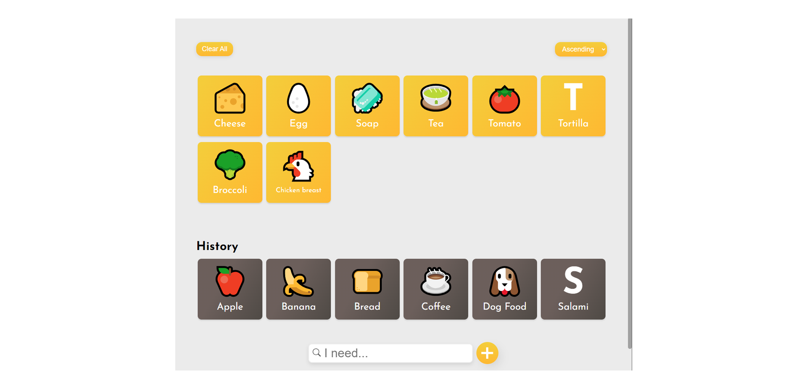

# EasyGrocery


## Getting Started

EasyGrocery is a user-friendly React-based shopping list app designed to simplify your grocery shopping experience.



[]()
[]()
[](https://app.netlify.com/sites/bncpntk-easy-grocery/deploys)

## Website
[**Visit EasyGrocery**](https://bncpntk-easy-grocery.netlify.app)

## Tech stack
- Icons: [emoji-dictionary](https://www.npmjs.com/package/emoji-dictionary)
- Frontend: [React](https://reactjs.org/)
- Styling: [CSS](https://developer.mozilla.org/en-US/docs/Web/CSS)
- Deployment: [Netlify](https://www.netlify.com/)

## Features
 ### Planned
* Handle plural item names
* replacing current emoji style
* Implement editing items
* Enable deleting a single item
* Provide styling options   
* Add database integration
  
### Current
* Sort items in ascending order or the order they were added
* Save items and settings to local storage      
* Clear all items
      
       
       

## Install
```bash
# Clone the repository
git clone https://github.com/BncPntk/EasyGrocery.git

# Change into the project directory
cd EasyGrocery

# Install dependencies
npm install
